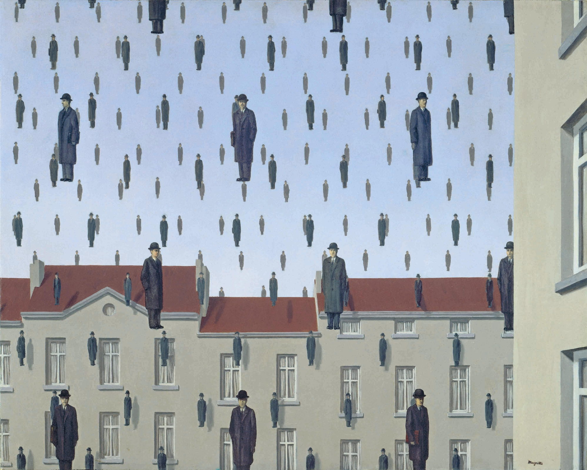
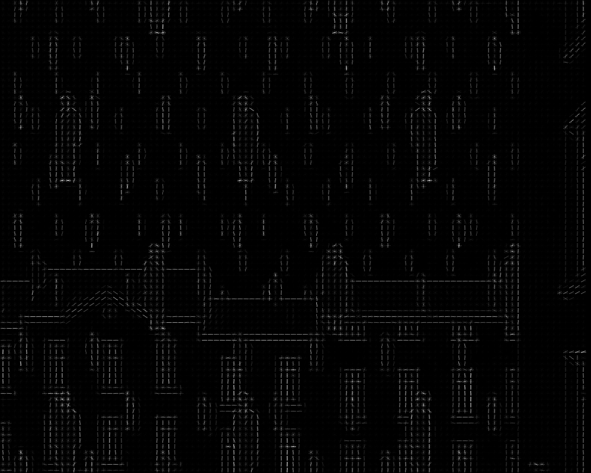

# Image-Processing-Visuals
Implementation of a variety of different techniques and tools to produce visualizations,

## HoG
```bash
positional arguments:
  path           Path to the image

optional arguments:
  -h, --help     show this help message and exit

  --ratio RATIO  Indicates the ratio of the resizing of the produced image
```

#### Original


#### HoG
