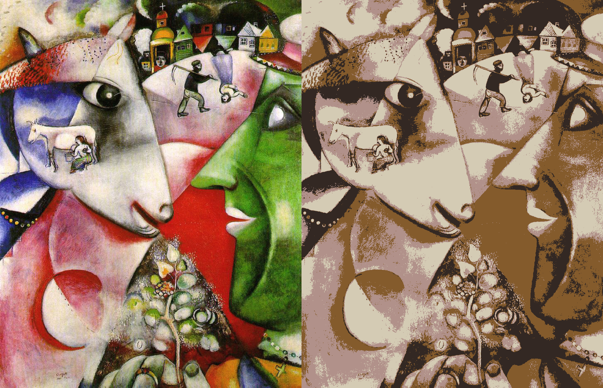

# Image-Processing-Visuals
Implementation of a variety of different techniques and tools to produce visualizations,

## HoG
```bash
python HoG.py --help
usage: HoG.py [-h] [--ratio RATIO] path

Image Processing tool to produce HoG visualizations

positional arguments:
  path           Path to the image

optional arguments:
  -h, --help     show this help message and exit

  --ratio RATIO  Indicates the ratio of the resizing of the produced image
```

#### Original


#### HoG


## Harris
```bash
python harris.py --help

usage: harris.py [-h] [--path PATH] [--threshold THRESHOLD]

Image Processing tool to produce Harris visualizations

optional arguments:
  -h, --help            show this help message and exit
  --path PATH           Path to the image
  --threshold THRESHOLD Indicates the threshold to detect corners
```

#### Kandinsky


#### Harris


## Vector Quantization
```bash
python quant.py --help
usage: quant.py [-h] [--path PATH] [--clusters CLUSTERS]

Image Processing tool to produce Vector Quantization visuals

optional arguments:
  -h, --help           show this help message and exit
  --path PATH          Path to the image
  --clusters CLUSTERS  Number of clusters
```

#### Chagall with 4 clusters

